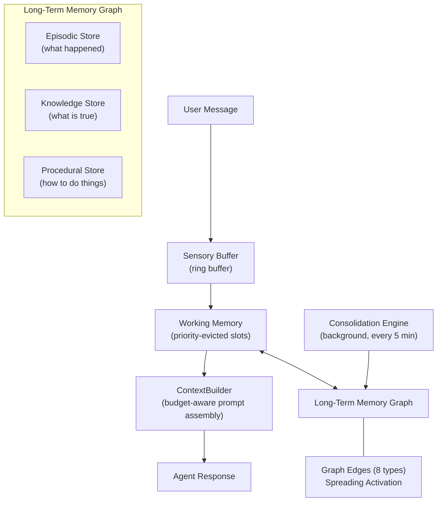
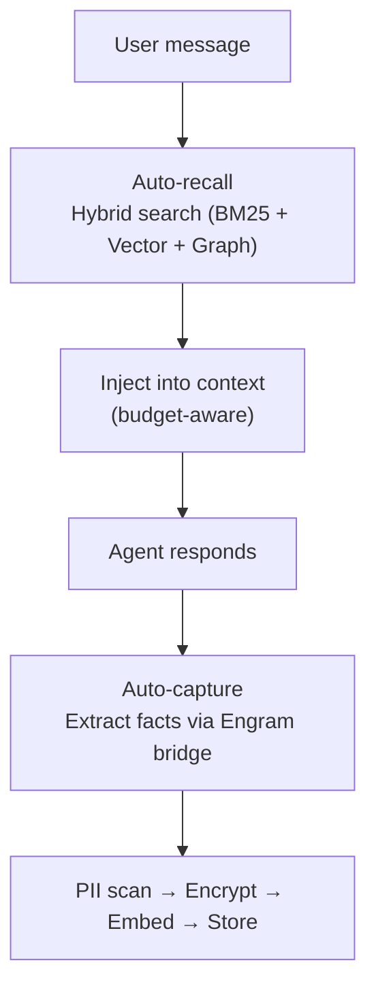
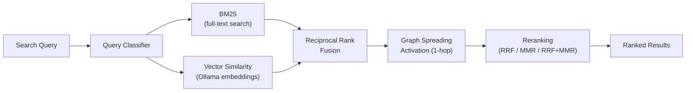

# Memory

Pawz uses **Project Engram**, a biologically-inspired three-tier memory architecture that lets agents remember facts, preferences, and context across conversations with graph-based knowledge management, hybrid search, and automatic PII encryption.

## Architecture

Engram models memory after human cognitive architecture with three tiers:



| Tier | Analogy | Role |
|------|---------|------|
| **Sensory Buffer** | Iconic/echoic memory | Ring buffer holding raw tokens; discarded after each turn |
| **Working Memory** | Short-term memory | Priority-evicted slots feeding the context window |
| **Long-Term Memory** | Declarative + procedural memory | Persistent graph with episodic, knowledge, and procedural stores |

### How it works



## Configuration

Go to **Settings → Sessions** to configure memory:

| Setting | Default | Description |
|---------|---------|-------------|
| **Embedding model** | `nomic-embed-text` | Model used to create vector embeddings |
| **Embedding base URL** | `http://localhost:11434` | Ollama endpoint for embeddings |
| **Embedding dimensions** | 768 | Vector size (match your model) |
| **Auto-recall** | On | Automatically retrieve relevant memories |
| **Auto-capture** | On | Automatically extract facts from conversations |
| **Recall limit** | 5 | Max memories injected per message |
| **Recall threshold** | 0.3 | Minimum relevance score (0–1) |

## Memory categories

Each memory is tagged with a category:

| Category | Use case |
|----------|----------|
| `general` | Catch-all |
| `preference` | User likes/dislikes, style preferences |
| `instruction` | Standing orders, rules |
| `context` | Background information |
| `fact` | Concrete facts, dates, numbers |
| `project` | Project-specific context |
| `person` | Info about people |
| `technical` | Technical details, tools, configs |
| `task_result` | Completed task outcomes |
| `session` | Compacted session summaries |
| `observation` | Agent observations about patterns |
| `goal` | User goals and objectives |
| `skill` | Learned capabilities and procedures |
| `relationship` | Connections between entities |
| `temporal` | Time-based events and deadlines |
| `emotional` | Sentiment and emotional context |
| `creative` | Creative works, drafts, ideas |
| `system` | System state and configuration notes |

## Hybrid search

Memory retrieval uses a three-signal hybrid algorithm fused with Reciprocal Rank Fusion (RRF):



1. **BM25** — text relevance via full-text search with porter stemming
2. **Vector cosine similarity** — semantic meaning via Ollama embeddings
3. **Graph spreading activation** — 1-hop traversal of typed memory edges to find related memories
4. **RRF fusion** — merges all three signals without requiring score normalization
5. **Reranking** — configurable strategy: RRF, MMR (maximal marginal relevance), or combined
6. **Keyword fallback** — when both BM25 and vector search return no results, the engine falls back to a keyword search using SQL `LIKE` on memory content. This ensures memories can always be found even when embeddings are unavailable or the full-text index misses a match.

:::tip Keyword fallback
The keyword fallback is automatic — you don't need to configure anything. If semantic search and BM25 both return empty results for a query, Pawz transparently retries with a simple substring match so you never get a false "no results found."
:::

### Tuning search

In the Memory Palace, you can adjust:

| Parameter | Default | Effect |
|-----------|---------|--------|
| BM25 weight | 0.4 | Text match importance |
| Vector weight | 0.6 | Semantic match importance |
| Decay half-life | 30 days | How fast old memories fade |
| MMR lambda | 0.7 | 1.0 = pure relevance, 0.0 = max diversity |
| Threshold | 0.3 | Minimum score to include |

## Memory Palace

The Memory Palace is a dedicated view for managing all stored memories. It is organized into four tabs:

### Tabs

| Tab | Purpose |
|-----|-------|
| **Recall** | Semantic search interface — enter a natural-language query and view ranked results with relevance scores |
| **Remember** | Manual memory creation form — set content, category, and importance then save |
| **Graph** | Force-directed graph visualization of memory relationships, grouped by category with color-coded bubbles sized by importance |
| **Files** | Browse agent personality files (`IDENTITY.md`, `SOUL.md`, etc.) stored on disk |

#### Recall

Type a query into the search box and press **Enter** (or click the search button). Results are displayed as cards showing the category tag, relevance score (percentage), content preview, and importance. Clicking a memory in the sidebar also opens it in the Recall tab.

#### Remember

Manually store a new memory by filling in:
- **Content** — the text to remember
- **Category** — select from the standard categories (general, preference, instruction, etc.)
- **Importance** — 1–10 scale

Click **Save Memory** to persist it. The sidebar and stats update automatically.

#### Graph

Click **Render** to generate a bubble-chart visualization. Memories are grouped by category and laid out in a circle. Each bubble represents one memory — its size reflects importance, and its color maps to the category. This gives a quick visual overview of what your agent knows and where knowledge is concentrated.

#### Files

Browse and edit the agent's identity and personality files that live on disk. This tab is always available, even when the embedding model is not configured.

### Embedding status banner

At the top of the Memory Palace, a status banner shows whether the embedding model is loaded and operational:

| Status | Banner |
|--------|--------|
| Ollama not running | ⚠️ Warning — semantic search disabled, falls back to keyword matching |
| Model not pulled | ℹ️ Info — prompts you to pull the model (~275 MB) with a one-click button |
| Memories need vectors | ℹ️ Info — offers a **Embed All** button to backfill embeddings for existing memories |
| All good | ✅ Success — shows active model name (e.g. `nomic-embed-text` via Ollama) |

:::note
When embeddings are unavailable the banner tells you that memory search will fall back to keyword matching. You can still store and retrieve memories — just without semantic ranking.
:::

### Recent memories sidebar

On the right side of the Memory Palace, a sidebar displays the **20 most recently stored memories** for quick reference. Each card shows:
- Category tag
- Content preview (first 60 characters)
- Importance score

Click any card to jump to its full details in the Recall tab. A search box at the top of the sidebar lets you filter the visible cards by keyword.

### JSON export

Click the **Export** button in the Memory Palace toolbar to download all memories as a JSON file. The export includes:

```json
{
  "exportedAt": "2026-02-20T12:00:00.000Z",
  "source": "Paw Desktop — Memory Export",
  "totalMemories": 42,
  "memories": [
    {
      "id": "...",
      "content": "User prefers dark mode",
      "category": "preference",
      "importance": 7,
      "created_at": "..."
    }
  ]
}
```

The file is named `paw-memories-YYYY-MM-DD.json`. Use this for backup or to transfer memories between machines.

## Slash commands

Quick memory operations from any chat:

```
/remember <text>    Store a memory manually
/forget <id>        Delete a memory by ID
/recall <query>     Search memories and show results
```

## Auto-capture

When auto-capture is enabled, the engine extracts memorable facts from conversations using heuristics. It looks for:

- User preferences ("I prefer...", "I like...")
- Explicit instructions ("Always...", "Never...")
- Personal context (names, locations, roles)
- Concrete facts (dates, numbers, decisions)

## Embedding setup

Pawz auto-manages embeddings via Ollama:

1. Checks if Ollama is reachable
2. Auto-starts Ollama if needed
3. Checks if the embedding model is available
4. Auto-pulls the model if missing
5. Tests embedding generation

If you switch embedding models, use **backfill** to re-embed existing memories.

## Embedding backends

The engine tries endpoints in order:
1. Ollama `/api/embed` (current API)
2. Ollama `/api/embeddings` (legacy API)
3. OpenAI-compatible `/v1/embeddings`

This means you can use any OpenAI-compatible embedding API by changing the base URL.

## Security

Memory in Pawz is protected at multiple levels:

| Layer | Protection |
|-------|-----------|
| **PII encryption** | Two-layer PII defense: 17 regex patterns (emails, SSNs, credit cards, JWTs, AWS keys, private keys, IBAN, etc.) detect and encrypt sensitive content with AES-256-GCM before storage. Encryption key stored in OS keychain (`paw-memory-vault`). |
| **At rest** | Sensitive database fields encrypted with AES-256-GCM, key stored in OS keychain |
| **In transit** | TLS certificate-pinned connections to embedding providers (Mozilla root CAs only, OS trust store excluded) |
| **In RAM** | Provider API keys wrapped in `Zeroizing<String>` — automatically zeroed from memory on drop |
| **Outbound** | Every embedding request SHA-256 signed and logged to a 500-entry audit ring buffer |
| **Query sanitization** | All search query operators stripped before execution to prevent injection |
| **Prompt injection** | 10-pattern scanner redacts prompt injection attempts in memory content with `[REDACTED:injection]` markers |
| **Inter-agent trust** | Memory bus enforces capability tokens (HMAC-SHA256 signed), scope/importance ceilings, per-agent rate limits, and trust-weighted contradiction resolution |
| **Anti-forensic** | Database padded to 512KB boundaries; two-phase secure delete prevents plaintext recovery |
| **GDPR compliance** | Article 17 purge command deletes all memories, embeddings, search index, and graph edges for a user |

:::info PII auto-encryption
Unlike the previous memory system which stored content unencrypted, Engram automatically scans memory content for PII patterns (emails, phone numbers, SSNs, credit cards, etc.) and encrypts matching content with field-level AES-256-GCM before writing to SQLite. Decryption happens transparently on retrieval.
:::

## Consolidation engine

Engram runs a background consolidation cycle every 5 minutes that maintains memory health:

| Operation | Purpose |
|-----------|---------|
| **Pattern clustering** | Groups related memories by semantic similarity |
| **Contradiction detection** | Identifies conflicting facts and resolves them |
| **Strength decay** | Applies Ebbinghaus-inspired forgetting curve — unused memories fade over time |
| **Garbage collection** | Removes memories whose strength has fallen below threshold |

### Memory strength

Each memory has a strength score (0.0–1.0) that decays over time. Accessing a memory boosts its strength. Important memories (importance > 0.7) decay slower. This ensures frequently-used knowledge persists while stale information is naturally pruned.

## Agent memory tools

Agents have access to 7 memory tools for direct memory management:

| Tool | Description |
|------|-------------|
| `memory_store` | Store a new memory with category and importance |
| `memory_search` | Hybrid search across all memory stores |
| `memory_delete` | Remove a specific memory by ID |
| `memory_list` | List recent memories with optional category filter |
| `memory_update` | Update an existing memory's content or metadata |
| `memory_link` | Create a typed edge between two memories |
| `memory_snapshot` | Export a point-in-time snapshot of the memory graph |

## Flow memory integration

When a flow runs, the executor automatically retrieves long-term memories so agent nodes have relevant context **before** they generate a response.

### Pre-recall at flow start

Before any node executes, the flow executor builds a memory query from the graph name and all agent prompts in the flow, then calls `pawEngine.memorySearch()`. The top results (filtered at score ≥ 0.3) are concatenated into a `memoryContext` string and stored in `FlowRunState`.

Every agent node receives this context in a `[Relevant Memory]` section prepended to its prompt via `buildNodePrompt()`.

### Cell-scoped memory in tesseract flows

Tesseract flows split work into parallel **cells** — independent sub-graphs that execute concurrently. Each cell needs different memory because the agents inside serve different purposes (e.g. a research cell vs. an analysis cell).

The Conductor solves this with **per-cell memory isolation**:

1. For each cell, a focused query is built from the cell's agent prompts (up to 3 agents, 200 chars each, capped at 300 chars total)
2. All cell queries are resolved concurrently via `deps.searchMemory()`, which calls `pawEngine.memorySearch()` with score ≥ 0.3 filtering
3. Results are stored in an immutable `resolvedCellMemory` map — computed once before execution begins
4. Each cell's executor receives a `ConductorDeps` wrapper that binds its memory override to every `executeNode` and `executeAgentStep` call

This eliminates shared-state mutation — parallel cells never race on `runState.memoryContext`.

### searchMemory IPC bridge

The `searchMemory` function on `ConductorDeps` bridges the flow engine to the Rust memory backend:

```typescript
searchMemory: async (query: string, limit: number) => {
  const results = await pawEngine.memorySearch(query, limit, agentId);
  return results
    .filter(m => m.score >= 0.3)
    .map(m => `[${m.category}] ${m.content}`)
    .join('\n');
}
```

This is the same hybrid search pipeline (BM25 + vector + graph spreading activation) used in chat sessions, so flow agents benefit from the full Engram retrieval stack.
